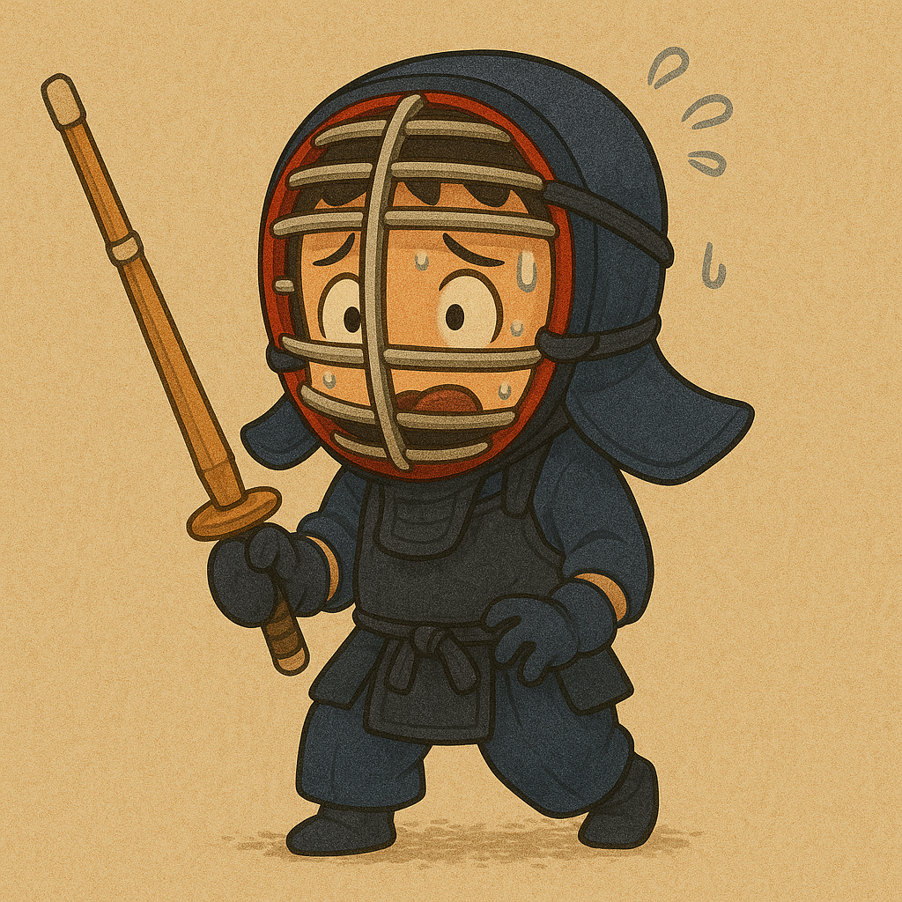

<p align="center">
  
  <h1 align="center">Fight Mode</h1>
  <p align="center"><b>Turn your to-do list into a battlefield.</b></p>
  <p align="center">Gamified productivity where every completed task is a victory, every streak is XP, and you collect warriors as you level up.</p>
</p>

<p align="center">
  <a href="https://github.com/Amloii/time-killing-app"></a>
  <a href="https://github.com/Amloii/time-killing-app"></a>
  <a href="https://bolt.new"></a>
  <a href="LICENSE"></a>
</p>

<p align="center">
  <a href="#-features">Features</a> •
  <a href="#-quick-start">Quick Start</a> •
  <a href="#-tech-stack">Tech Stack</a> •
  <a href="#-how-it-works">How It Works</a> •
  <a href="#-project-structure">Structure</a>
</p>

<br>

> **Built for the [Bolt Hackathon](https://bolt.new).**  
> Fight Mode transforms the chore of task management into a samurai-themed RPG. Every task is an enemy, every work session is a battle, and every streak is a war won.

---

## ✨ Features

- **Battle Mode** — Enter a timed work session with your selected tasks. A pomodoro-style countdown fuels focused sprints. Complete all tasks before time runs out to win the battle.
- **Task Chop** — Drop a vague task and let AI (Gemini or OpenAI) break it into concrete, actionable subtasks with time estimates and difficulty ratings.
- **Warrior Collection** — Earn points, unlock warriors (Common → Rare → Epic → Legendary), and set your active warrior as your productivity companion.
- **Smart Suggestions** — AI estimates task difficulty and duration based on your description and history of completed tasks.
- **Streak System** — Consecutive days of completed tasks build your streak multiplier, boosting points and momentum.
- **Statistics Dashboard** — Track completion rate, total tasks, average difficulty, time invested, and recent activity.
- **Task Management** — Full CRUD with difficulty levels, estimated time, tags, subtasks, and drag-and-drop reordering (react-beautiful-dnd).
- **Samurai Aesthetic** — Japanese-inspired UI with wave patterns, sakura motifs, custom typography (Anton, Oswald, Noto Serif JP), and subtle framer-motion animations.

<br>

---

## 🚀 Quick Start

```bash
# Clone
git clone https://github.com/Amloii/time-killing-app.git
cd time-killing-app

# Install
npm install

# Start dev server
npm run dev
```

Open `http://localhost:5173` in your browser.

### AI features (optional)

To use AI task analysis, set your API key in the settings panel inside the app:

- **Gemini**: Get a key at [aistudio.google.com](https://aistudio.google.com/apikey)
- **OpenAI**: Get a key at [platform.openai.com](https://platform.openai.com/api-keys)

API keys are stored locally in your browser and never sent to any server other than the provider's API.

<br>

---

## 🏗 Tech Stack

| Layer | Technology |
|---|---|
| Framework | React 18 (TypeScript) |
| Bundler | Vite 5 |
| Styling | TailwindCSS 3 |
| State | Zustand |
| Animations | Framer Motion |
| Drag & Drop | react-beautiful-dnd |
| Notifications | sonner |
| Dates | date-fns |
| AI (Gemini) | `@google/generative-ai` |
| AI (OpenAI) | `openai` |
| Icons | Lucide React |
| Persistence | localStorage |

<br>

---

## ⚔️ How It Works

### 1. Create tasks
Add tasks with a title, description, difficulty (1–5), and estimated time. Tag and categorize them. Let AI suggest difficulty and time if you're unsure.

### 2. Chop big tasks
Select any task and hit **Chop**. AI analyzes it and returns a set of subtasks with individual estimates. Approve, edit, or discard — then conquer them one by one.

### 3. Enter battle mode
Select tasks for your battle session. Set a timer. When you're ready, **Start Battle** — a focused work sprint begins with a ticking clock and a clear target.

### 4. Earn rewards
Each completed task awards points based on difficulty, streaks, and early completion bonuses. Spend points to unlock warriors from the rewards shop.

### 5. Level up
Your active warrior fights alongside you. As your streak grows and tasks fall, you ascend levels. The more you ship, the stronger your roster.

<br>

---

## 📁 Project Structure

```
src/
├── pages/
│   ├── Dashboard.tsx       # Main hub — tasks + battle + settings
│   ├── Rewards.tsx          # Warrior shop & collection
│   ├── Statistics.tsx       # Completion stats & history
│   └── TaskDetails.tsx      # Single task view
├── components/
│   ├── battle/              # Battle mode (preparation, timer, progress)
│   ├── tasks/               # Task list, form, chop modal
│   ├── rewards/             # Warrior cards & filters
│   ├── settings/            # LLM provider config
│   ├── layout/              # Navigation shell
│   └── common/              # Card, Button, Mascot, PointsDisplay
├── store/
│   └── index.ts             # Zustand state (tasks, sessions, profile)
├── utils/
│   ├── warriors.ts          # Warrior definitions & stats
│   ├── gemini.ts            # Gemini API integration
│   ├── llm/                 # Provider abstraction (Gemini + OpenAI)
│   ├── pointsCalculator.ts  # Points & XP formulas
│   ├── localStorage.ts      # Persistence layer
│   └── formatters.ts        # Date & number helpers
└── types/
    └── index.ts             # TypeScript interfaces
```

<br>

---

## 🛠 Scripts

```bash
npm run dev       # Start dev server
npm run build     # Production build
npm run preview   # Preview production build
npm run lint      # Run ESLint
```

<br>

---

## 👤 About the Author

**Daniel Gómez Domínguez** — AI Systems Architect & Director of AI.

Fight Mode was born at a Bolt hackathon as an exploration of how game mechanics can make personal productivity feel less like work and more like a quest.

[GitHub](https://github.com/Amloii) · [LinkedIn](https://linkedin.com/in/danigdominguez) · [Portfolio](https://amloii-page.pages.dev)

<br>

---

<p align="center">
  <sub>Built with React, Zustand, and a samurai spirit.</sub>
</p>
